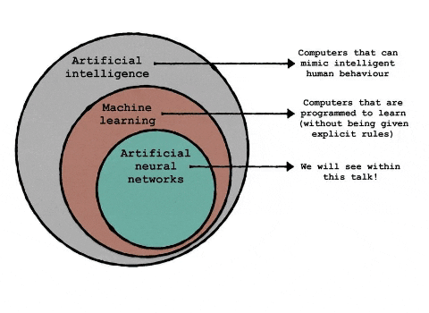

# Data Science Projects 

# Context :

As I explore the broad and fascinating world of data science, I will collate some of projects into IPython notebooks hosted on my <a href = "https://www.kaggle.com/sthabile">Kaggle profile</a>. The same projects and some additional ones will appear in this repository. 

I am interested in building predictive models using neural networks, exploratory data analysis of interesting topics in sport, music, trivia and pop culture, image preprocessing and deep learning algorithms.   

Watch this space!

